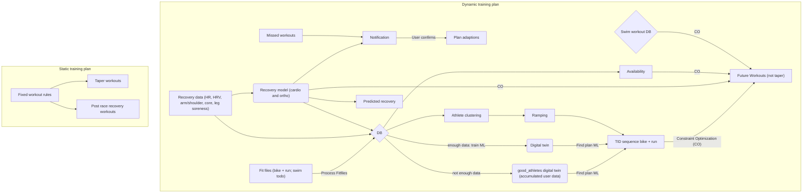

```mermaid
graph TD
subgraph Dynamic training plan
    A["Fit files (bike + run; swim todo)"] -->|Process Fitfiles| B{DB}
    C["Recovery data (HR, HRV, arm/shoulder, core, leg soreness)"] --> B
    C --> D("Recovery model (cardio and ortho)")
    D --> B
    B -->|not enough data| Ba("good_athletes digital twin (accumulated user data)")
    B -->|enough data: train ML| E(Digital twin)
    Ba -->|Find plan ML| F
    E -->|Find plan ML| F[TID sequence bike + run]
    F --> |"Constraint Optimization (CO)"| G["Future Workouts (not taper)"]
    D -->|CO| G
    H[Availability] -->|CO| G 
    B --> H
    D --> I[Notification]
    I -->|User confirms| J[Plan adaptions]
    D --> K[Predicted recovery]
    O{Swim workout DB} -->|CO| G
    B --> P
    P[Athlete clustering] --> R
    Q[Missed workouts] --> I
    R[Ramping] --> F
end
subgraph Static training plan
    L["Fixed workout rules"] --> M[Taper workouts]
    L --> N[Post race recovery workouts]
end
```
